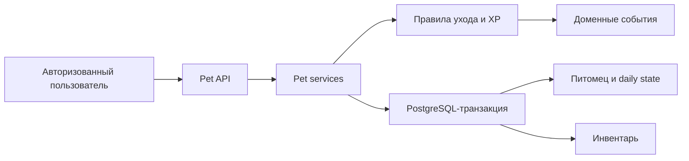

# Станислав Михалев — backend-вклад в «Авитошу»

Этот репозиторий содержит мою backend-часть командного проекта «Авитоша»: ядро виртуального питомца. Я интегрировал доменную модель, PostgreSQL-хранение, транзакционную обработку, защищённый HTTP API и тесты в существующую инфраструктуру команды.

## Результат

Питомец создаётся для авторизованного пользователя, имеет уровень и опыт, а его ежедневное состояние зависит от трёх показателей: сытости, настроения и любознательности. Пользователь применяет игровые предметы — еду, игрушку и книгу; показатели меняются, состояние питомца пересчитывается, за позитивные состояния начисляется XP, а при достижении порога повышается уровень.

## Что я реализовал

### 1. Домен и игровые правила

- модели питомца, ежедневного состояния, инвентаря и доменных событий;
- автоматическое создание одного питомца «Авитоша» для каждого пользователя;
- состояния `CURIOUS`, `HUNGRY`, `BORED`, `CONTENT`, `HAPPY` и `ECSTATIC`;
- механику `FOOD`, `TOY` и `BOOK`: каждый предмет увеличивает соответствующий показатель, но не выше 100;
- уровни и XP: награды за `HAPPY` и `ECSTATIC` выдаются не более одного раза в день;
- daily summary и события изменения состояния и уровня.

### 2. Надёжное хранение и обработка действий

Я создал SQL-миграции и PostgreSQL-репозитории для таблиц `pets`, `pet_daily_states` и `inventory_items`. Использование предмета выполняется внутри общей транзакции приложения. Блокировки строк (`FOR UPDATE`), ограничения БД и `idempotency_key` защищают от параллельного или повторного применения одного и того же предмета.

### 3. Авторизованный API

Реализованы и описаны в OpenAPI маршруты:

- `GET /api/pet` — получить или создать питомца;
- `POST /api/pet/items/{item_id}/use` — применить предмет;
- `GET /api/pet/daily-summary` — получить сводку за предыдущий день.

Пользователь определяется из существующей JWT-аутентификации приложения, а не из доверенного пользовательского заголовка.

### 4. Интеграция и качество

Я использовал готовые компоненты команды для подключения к PostgreSQL, транзакций, HTTP-routing, логирования, health checks и graceful shutdown — без создания второго параллельного backend-приложения. Добавил unit-, repository-, migration-, handler- и smoke-тесты, а также воспроизводимую конфигурацию Go-линтера и корректные UTF-8 JSON-ответы.

## Почему это важно

Код переводит питомца из интерфейсной идеи в согласованный backend-сценарий: состояние, инвентарь, прогресс и события меняются атомарно. Повторный запрос не может повторно использовать предмет, а конкурентные действия не приводят к рассинхронизации данных.

## Карта кода

Подробная карта файлов находится в [FILES.md](./FILES.md). Основные точки входа:

- [`pet_rules.go`](./app/backend/internal/usecase/pet_rules.go) — игровые правила, XP и уровни;
- [`pet_care.go`](./app/backend/internal/usecase/pet_care.go) — сценарий использования предмета;
- [`pet.go`](./app/backend/internal/repository/postgres/pet.go) — PostgreSQL-работа с питомцем;
- [`pet.go`](./app/backend/internal/handler/pet.go) — HTTP handlers;
- [`000003_create_pet_core.up.sql`](./app/backend/migrations/000003_create_pet_core.up.sql) — схема БД.

## Подтверждение вклада

Исходники перенесены из моей ветки [`feat/pet-core-integration`](https://github.com/guitaramust-sudo/Avitosha/tree/feat/pet-core-integration) проекта [Avitosha](https://github.com/guitaramust-sudo/Avitosha). Серия из восьми коммитов автора `NimmWee <st.mixaleev@gmail.com>` включает домен, persistence, API, тесты и инструменты качества.

Этот репозиторий является сфокусированной выборкой моего вклада. Для полной сборки продукта используется исходный командный репозиторий.
